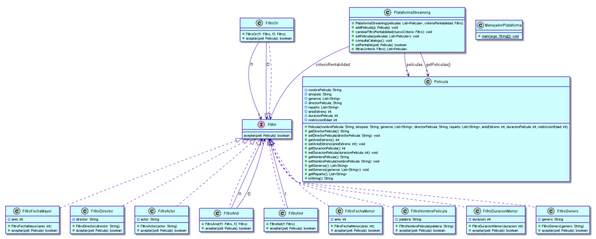
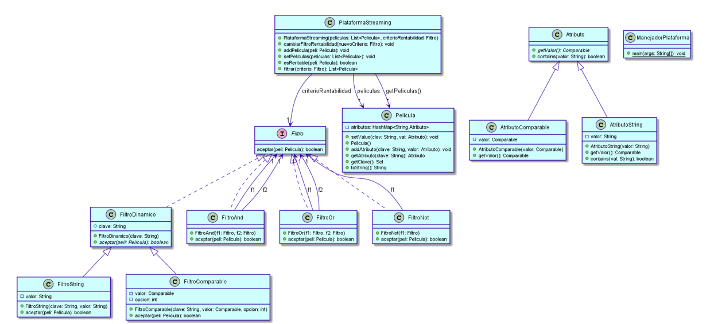

# oop-movie-manager

# Trabajo Práctico Especial - Programación Orientada a Objetos

## Descripción

Este proyecto es un Trabajo Práctico Especial de la materia **Programación Orientada a Objetos** de la **Universidad Nacional del Centro de la Provincia de Buenos Aires**. Su objetivo es demostrar el conocimiento adquirido en la materia, utilizando **Java** para desarrollar una plataforma de streaming que permite gestionar un catálogo de películas mediante distintos criterios de filtrado y rentabilidad.

## Autor

**Melisa Annabella Messa Muñoz**  
E-mail: messamelisa42@gmail.com

## Fecha

**29 de octubre de 2021**

---

## Objetivos del Proyecto

- Aplicar los principios de la Programación Orientada a Objetos (POO).
- Implementar una solución modular y reutilizable.
- Utilizar Java para desarrollar un sistema de filtrado eficiente de películas.
- Evitar la duplicación de código y mantener buenas prácticas de programación.

---

## Funcionalidades

Este proyecto desarrolla una **plataforma de streaming** que permite:

- **Agregar películas** al catálogo.
- **Filtrar películas** por distintos criterios como título, director, género, actores, año de estreno y duración.
- **Definir criterios de rentabilidad**, los cuales determinan qué películas pueden agregarse al catálogo.
- **Aplicar filtros compuestos** (AND, OR y NOT) para búsquedas más avanzadas.

---

## Estructura del Proyecto

El código está organizado en distintas clases para modelar el dominio del problema:

### **Clases Principales**

- **Pelicula**: Representa una película con atributos como título, sinopsis, género, director, actores, año de estreno y restricción de edad.
- **PlataformaStreaming**: Gestiona el catálogo de películas y permite aplicar filtros y definir criterios de rentabilidad.
- **ManejadorPlataforma**: Contiene el `main` y se encarga de la carga de datos y pruebas.

### **Sistema de Filtros**

Para realizar búsquedas dinámicas y estructuradas, se implementaron diferentes clases de **filtros**, basadas en una interfaz común:

- **FiltroActor, FiltroDirector, FiltroGenero, FiltroNombrePelicula**: Permiten filtrar películas en base a atributos específicos.
- **FiltroFechaMenor, FiltroDuracionMenor, FiltroDuracionMayor**: Comparan valores numéricos como el año de estreno o la duración.
- **FiltroAnd, FiltroOr, FiltroNot**: Permiten combinar filtros para realizar consultas más avanzadas.

### **Sistema Mejorado (Inciso B)**

Para mejorar la flexibilidad y reducir la dependencia de atributos fijos, se implementaron:

- **Uso de `HashMap<String, Atributo>`** en la clase `Pelicula`, lo que permite almacenar atributos de manera dinámica.
- **AtributoString y AtributoComparable**: Clases que encapsulan valores de atributos y permiten realizar comparaciones y búsquedas eficientes.
- **FiltroDinamico, FiltroString, FiltroComparable**: Extienden la interfaz `Filtro` para manejar búsquedas dinámicas sobre cualquier atributo.

---

## Ejemplos de Uso

### **Búsqueda de películas con la palabra "luna" en el título**

```java
Filtro filtroPalabraLuna = new FiltroNombrePelicula("luna");
List<Pelicula> resultado = plataforma.filtrar(filtroPalabraLuna);
System.out.println(resultado);
```

**Resultado:** Se imprimen todas las películas que contienen "luna" en su título.

### **Definir criterio de rentabilidad: películas posteriores a 2017, excepto infantiles o documentales**

```java
Filtro filtroFechaMayor = new FiltroFechaMayor(2017);
Filtro filtroGeneroInfantil = new FiltroGenero("infantil");
Filtro filtroGeneroDocumental = new FiltroGenero("documental");
Filtro filtroOrGenero = new FiltroOr(filtroGeneroInfantil, filtroGeneroDocumental);
Filtro filtroRentabilidad = new FiltroOr(filtroFechaMayor, filtroOrGenero);
plataforma.cambiarFiltroRentabilidad(filtroRentabilidad);
```

**Resultado:** Solo se agregan al catálogo películas estrenadas después de 2017 o que sean del género infantil o documental.

---

## Requisitos

Para ejecutar el proyecto, es necesario tener instalado:

- **Java 8 o superior**
- Un IDE como **Eclipse**, **IntelliJ IDEA** o **NetBeans**

---

## Instalación y Ejecución

1. Clonar este repositorio:
   ```sh
   git clone https://github.com/usuario/repositorio.git
   ```
2. Importar el proyecto en el IDE de preferencia.
3. Compilar y ejecutar `ManejadorPlataforma.java`.

---

## Diagrama de Clases




---

¡Gracias por revisar este proyecto! 🚀
